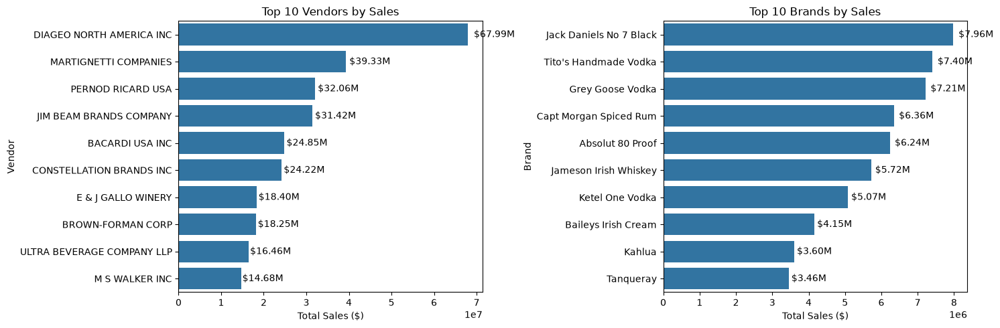

# Vendor Performance Analysis

This project turns raw inventory, purchase, sales, price, and freight records into a single vendor-performance dataset. It is designed to help a business understand which vendors and products generate sales and profit, where stock may be moving slowly, and where purchasing or pricing decisions may need attention.

The project uses SQLite for storage, Python and pandas for data preparation, and Jupyter notebooks for exploration and visual analysis.

## What this project does

The workflow has three stages:

1. Load the CSV files in `data/` into a local SQLite database named `inventory.db`.
2. Combine purchases, sales, prices, and freight into a `vendor_sales_summary` table and calculate business metrics.
3. Explore the resulting table in notebooks to identify patterns in vendors, brands, margins, inventory turnover, and purchasing behaviour.

In simple terms: the raw files describe what was bought, sold, priced, and shipped. The scripts combine that information so it can be analysed in one place.

## Project structure

| Path | Purpose |
| --- | --- |
| `data/` | Input CSV files used by the pipeline. |
| `ingestion_db.py` | Loads every CSV in `data/` into SQLite tables. |
| `get_vendor_summary.py` | Builds the cleaned `vendor_sales_summary` table and calculates performance metrics. |
| `inventory.db` | Local SQLite database created and used by the scripts. This file can be large. |
| `exploray_data_analysis.ipynb` | Exploratory notebook for inspecting database tables and vendor-level data. |
| `vendor_perfomance_analysis.ipynb` | Main notebook for vendor, brand, profitability, turnover, and purchasing analysis. |
| `test_notebook_final_merge.py` | Regression test for the final merge logic in the exploratory notebook. |
| `logs/` | Runtime logs written by the ingestion and summary scripts. |

> Note: the notebook filenames use the existing spelling, `exploray` and `perfomance`.

## Input data

The `data/` folder currently contains these source files:

| File | Used for |
| --- | --- |
| `purchases.csv` | Purchase transactions, quantities, costs, products, and vendors. |
| `sales.csv` | Sales quantities, sales value, prices, and excise tax. |
| `purchase_prices.csv` | Product prices and volumes by vendor. |
| `vendor_invoice.csv` | Vendor freight costs. |
| `begin_inventory.csv` | Beginning inventory records. |
| `end_inventory.csv` | Ending inventory records. |
| `vendor_sales_summary.csv` | A supplied summary extract; the reproducible pipeline creates its own summary table in SQLite. |

Do not rename the CSV files without also updating any code that refers to their table names. The ingestion script uses each filename (without `.csv`) as the SQLite table name.

## Requirements

Use Python 3.10 or newer. Install the packages used by the scripts and notebooks:

```bash
python -m pip install pandas sqlalchemy numpy matplotlib seaborn plotly scipy jupyter pytest
```

The standard-library `sqlite3` module is used for database connections, so no separate database server is required.

## Run the project

Open a terminal in the project folder and run the following commands in order.

### 1. Load the raw files into SQLite

```bash
python ingestion_db.py
```

This command reads every `.csv` file inside `data/` and stores it in `inventory.db`. It also creates `logs/` if it does not already exist and records activity in `logs/ingesting_db.log`.

### 2. Create the vendor summary

```bash
python get_vendor_summary.py
```

This command reads the relevant SQLite tables, joins the purchase, sales, pricing, and freight information, cleans the result, and writes the final dataset to the `vendor_sales_summary` table in `inventory.db`. Progress and sample rows are recorded in `logs/get_vendor_summary.log`.

### 3. Open the notebooks

```bash
jupyter notebook
```

Then open either notebook from the browser:

- Start with `exploray_data_analysis.ipynb` if you want to inspect the database and individual vendor data.
- Open `vendor_perfomance_analysis.ipynb` for the complete business analysis and charts.

Run notebook cells from top to bottom. The performance notebook expects the `vendor_sales_summary` table to have been created first.

## How the vendor summary is built

`get_vendor_summary.py` creates three intermediate summaries:

| Summary | Information included |
| --- | --- |
| Purchase summary | Vendor, product, purchase price, volume, purchased quantity, and purchase value. |
| Sales summary | Sold quantity, sales value, sales price, and excise tax by vendor and brand. |
| Freight summary | Total freight cost by vendor. |

The script joins these summaries by vendor and brand where applicable. Sales and freight are joined with a left join, which keeps purchase records even if matching sales or freight data is missing. Missing numeric values are then replaced with zero so calculations can continue.

## Key business metrics

The cleaned summary includes the following calculated fields:

| Metric | Calculation | Plain-language meaning |
| --- | --- | --- |
| `GrossProfit` | `TotalSalesDollars - TotalPurchaseDollars` | Sales revenue left after the recorded purchase cost. |
| `ProfitMargin` | `(GrossProfit / TotalSalesDollars) × 100` | Gross profit expressed as a percentage of sales. |
| `StockTurnOver` | `TotalSalesQuantity / TotalPurchaseQuantity` | The relationship between units sold and units purchased. A lower value can indicate slower movement or excess stock. |
| `SalesToPurchaseRatio` | `TotalSalesDollars / TotalPurchaseDollars` | Sales value earned for each dollar spent on purchases. |

These are analytical indicators, not final accounting figures. For example, the calculation does not allocate freight to individual products, and zero sales can result in undefined ratios. Interpret results alongside the underlying data and business context.

## Analysis included in the main notebook

`vendor_perfomance_analysis.ipynb` loads `vendor_sales_summary` and explores it through tables, statistical summaries, and visualizations. The analysis includes:

- Data quality checks: shape, data types, missing values, distributions, and outliers.
- A profitability-focused subset containing records with positive gross profit, positive margin, and positive sales quantity.
- Brand performance: total sales, sales quantity, gross profit, and average profit margin by brand and description.
- Low-sales, high-margin brands that may warrant targeted promotion or pricing review.
- Top vendors and brands by sales.
- Vendor-level profit-margin comparisons.
- Inventory turnover and low-turnover vendors.
- Purchasing patterns, including the relationship between order size and unit purchase price.
- Statistical comparisons of profit margin across high- and low-sales groups.

### Sales leaders at a glance



*The left chart ranks vendors by total sales; the right chart ranks individual brands. This view quickly identifies the suppliers and products that contribute the most revenue.*

The charts are intended to support questions such as: “Which vendors drive revenue?”, “Which brands have attractive margins but limited sales?”, and “Where could inventory be moving more slowly than expected?”

## Verify the notebook merge logic

Run the regression test with:

```bash
python -m pytest test_notebook_final_merge.py
```

The test checks that the final merge cell in `exploray_data_analysis.ipynb` correctly preserves freight cost and calculates average sales price from the supplied sample data.

## Logs and troubleshooting

### `data` folder not found

Run the scripts from the project root, the folder that contains `data/`, `ingestion_db.py`, and `get_vendor_summary.py`.

### `no such table` or missing `vendor_sales_summary`

Run the pipeline again in order:

```bash
python ingestion_db.py
python get_vendor_summary.py
```

### Notebook variable errors

Restart the notebook kernel and choose **Run All Cells**. A notebook can show an error when cells are run out of order and a dataframe from an earlier cell has not been created.

### Large files or slow processing

The sales and purchase files are large, so ingestion can take time and `inventory.db` can become several gigabytes. Ensure there is sufficient disk space, keep the laptop connected to power, and avoid moving or editing the CSV files while a script is running.

### Need more detail about a run

Review these log files:

```text
logs/ingesting_db.log
logs/get_vendor_summary.log
```

## Important notes

- `ingestion_db.py` replaces each database table when it reloads a CSV file.
- `get_vendor_summary.py` replaces the `vendor_sales_summary` table each time it runs.
- The database is local to this project; no external database credentials are needed.
- The analysis should be treated as decision support. Validate unexpected values, unusually high margins, and low turnover against operational records before acting on them.
